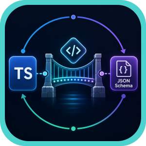
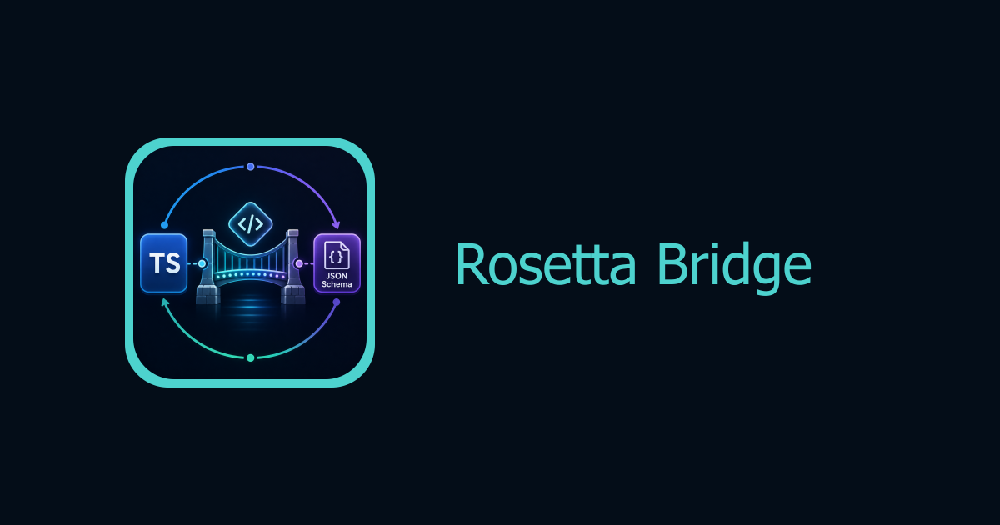

<div align="center">

<p>
  
</p>

<h1>
  Rosetta Bridge
</h1>

<p>
  Request normalization engine for multi-provider inference workloads. Built with JSON Schema and TypeScript adapters.
</p>

<p>
  <strong>One public request. Many provider dialects. No silent schema drift.</strong>
</p>

<br />

[](https://babysea.ai/blog/how-babysea-built-strict-request-normalization-with-json-schema-and-typescript)

<br />



<br/>
<br/>

<strong>Project</strong>

[](#babysea-oss-taxonomy)
[](#status)
[](LICENSE)

<br/>

<strong>Checks</strong>

[](https://app.circleci.com/pipelines/github/babysea-community/rosetta-bridge)
[](https://codecov.io/github/babysea-community/rosetta-bridge)
[](https://github.com/babysea-community/rosetta-bridge/actions/workflows/snyk-security.yml)
[](https://github.com/babysea-community/rosetta-bridge/actions/workflows/sentry-check.yml)
[](https://github.com/babysea-community/rosetta-bridge/actions/workflows/codeql.yml)
[](https://github.com/babysea-community/rosetta-bridge/actions/workflows/publish-check.yml)

<br/>

<strong>Built with</strong>

[](https://json-schema.org)
[](https://www.typescriptlang.org)
[](#5-architecture)

</div>

---

## BabySea OSS taxonomy

BabySea open source projects are organized into three categories:

[](#babysea-oss-taxonomy)
[](#babysea-oss-taxonomy)
[](#babysea-oss-taxonomy)

| Category      | Description                                                                                                                                       |
| :------------ | :------------------------------------------------------------------------------------------------------------------------------------------------ |
| **SDK**       | Typed developer entry points for creating, tracking, and managing BabySea workloads from application code.                                        |
| **Primitive** | Reusable infrastructure boundaries extracted from BabySea's execution control plane. Each primitive focuses on one system concern.                |
| **Starter**   | Deployable reference applications that combine product UI, auth, storage, and BabySea execution patterns. Some starters may also include billing. |

## Status

BabySea OSS projects are published into three status levels:

[](#status)
[](#status)
[](#status)

| Status         | Description                                                                                                                                                                          |
| :------------- | :----------------------------------------------------------------------------------------------------------------------------------------------------------------------------------- |
| **Working**    | Fully implemented and deployable. All documented capabilities function as described. Suitable for personal and small-team use. No breaking-change guarantees between versions.       |
| **Production** | Working plus a hardened public runtime contract. Validated against a stated infrastructure stack with deterministic behavior, explicit failure modes, and a documented upgrade path. |
| **Alpha**      | Early-stage implementation. Core structure exists but some capabilities may be incomplete, undocumented, or subject to breaking changes. Not recommended for production deployments. |

`rosetta-bridge` is a **production** OSS primitive. It packages the BabySea-style request normalization boundary as a TypeScript SDK plus JSON Schema contracts for community multi-provider media workloads. See [`CHANGELOG.md`](CHANGELOG.md).

## Table of contents

1. [Overview](#1-overview)
    - [What this is](#what-this-is)
    - [Short version](#short-version)
    - [Production lineage](#production-lineage)
    - [Grounding rule](#grounding-rule)
    - [Adoption path](#adoption-path)
2. [Stack contract](#2-stack-contract)
3. [Terminology](#3-terminology)
4. [Boundaries](#4-boundaries)
5. [Architecture](#5-architecture)
6. [Quick start](#6-quick-start)
    - [Build the TypeScript SDK](#build-the-typescript-sdk)
    - [Define a public schema](#define-a-public-schema)
    - [Map provider payloads](#map-provider-payloads)
    - [Use the CLI](#use-the-cli)
7. [Core capabilities](#7-core-capabilities)
    - [Why it's different](#why-its-different)
    - [The bug this prevents](#the-bug-this-prevents)
    - [Core invariants](#core-invariants)
    - [Production-derived schema discipline](#production-derived-schema-discipline)
    - [Pricing-sensitive core fields](#pricing-sensitive-core-fields)
    - [Fail-before-dispatch by design](#fail-before-dispatch-by-design)
8. [Production readiness](#8-production-readiness)
    - [Enterprise posture](#enterprise-posture)
    - [Configuration surface](#configuration-surface)
    - [Production deployment](#production-deployment)
    - [Release gates](#release-gates)
    - [Production checklist](#production-checklist)
    - [Monitoring](#monitoring)
    - [Backup and disaster recovery](#backup-and-disaster-recovery)
    - [Secret rotation](#secret-rotation)
    - [Troubleshooting](#troubleshooting)
9. [Version surface](#9-version-surface)
10. [Community](#10-community)
    - [Who's using it](#whos-using-it)
    - [Related projects](#related-projects)
    - [Contributing](#contributing)
11. [License](#11-license)

---

## 1. Overview

### What this is

`rosetta-bridge` is a request normalization primitive for teams integrating multiple media providers behind one product API. It validates a strict public request shape, applies declared defaults, and converts the normalized request into provider-native payloads at dispatch time.

The public package is intentionally scoped to TypeScript adapters and JSON Schema contracts. Auth, billing, persistence, queues, provider clients, webhooks, credit settlement, and routing intelligence stay in your application.

### Short version

Provider APIs drift. `rosetta-bridge` gives you one stable `request_*` schema and keeps provider-native field names inside adapters, so a fallback provider cannot silently change request semantics after validation.

### Production lineage

The primitive mirrors BabySea's production schema-hardening boundary: provider contracts are represented outside the customer request, strict public fields are validated with unknown-field rejection, defaults are declared in one place, canonical input can be persisted by the host after validation, and provider-native payloads are emitted through explicit mappers.

### Grounding rule

Public OSS behavior is limited to the TypeScript + JSON boundary implemented here: field specs, strict normalization, defaults, capability intersections, provider-order sentinels, prompt-enhancement helpers, moderation helpers, pricing-sensitive core fields, URL validation, canonical envelopes, and provider adapters. Hosted routes, private catalogs, credentials, provider SDK calls, queues, billing, telemetry, and Databricks routing are out of scope.

### Adoption path

Define a public bridge manifest, keep provider-specific mapping inside adapters, cover the manifest with fixtures, and call `normalize()`/`toProviderInput()` before enqueueing or dispatching. You bring your backend, provider clients, database, billing, and runtime. The bridge handles schema safety.

## 2. Stack contract

| Layer                | Required stack                                        | Runtime responsibility                                                                                     |
| :------------------- | :---------------------------------------------------- | :--------------------------------------------------------------------------------------------------------- |
| Provider contract    | Provider docs, OpenAPI, JSON Schema, or typed notes   | Record the external provider shape and intentional exclusions outside the public request.                   |
| Public request schema | `rosetta-bridge` field specs                         | Validate input, apply defaults, reject unknown fields, and keep provider-only names out of customer APIs.  |
| Provider adapter     | TypeScript mapper functions                           | Convert normalized request fields into one provider-native payload.                                        |
| Public contract      | JSON Schema Draft 2020-12                             | Version bridge manifests and normalization-result envelopes for docs, SDKs, and tests.                     |
| Integration boundary | Your backend, database, billing, queues, and SDKs     | Own auth, persistence, rate limits, provider calls, webhooks, and dispatch outside the bridge.             |

No hosted gateway, provider execution, queue worker, billing system, or routing service is part of this version contract.

## 3. Terminology

| Term                    | Meaning in this package                                                                                                               |
| :---------------------- | :------------------------------------------------------------------------------------------------------------------------------------ |
| Core field              | Provider-agnostic request field such as `request_prompt`, `request_aspect_ratio`, `request_output_format`, or `request_duration_seconds`. |
| Option field            | Public tuning field such as `request_seed`, `request_negative_prompt`, `request_enhance_prompt`, or `request_guidance_scale`.         |
| Provider field          | Provider-native API field. Provider names stay inside adapters, not in the public request schema.                                      |
| Provider adapter        | Converter with `mapCore`, `mapOptions`, and optional `mapStructured` functions.                                                        |
| Structured adapter      | Explicit exception for providers whose payload must be assembled as nested objects or arrays.                                          |
| Provider-order sentinel | `request_provider_order: 'fastest'` expands to the bridge's default provider order; the host application still chooses the active provider before dispatch. |
| Intersection            | The safe overlap of capabilities across active providers: ratios, formats, input limits, duration, resolution, audio, and other pricing dimensions. |

## 4. Boundaries

- Not a hosted inference gateway or provider router.
- Not BabySea's private model catalog, provider configuration, credentials, or routing code.
- Not a replacement for authorization, billing, rate limiting, persistence, queues, or webhooks.
- Not a code generator for every provider API.
- Not a runtime guarantee that providers keep their public APIs stable; adapter fixtures must cover the contract you depend on.

## 5. Architecture

```text
Customer request
  |
  v
RosettaBridge.normalize()
  | strict validation + declared defaults
  v
Canonical request envelope
  |- mapCore(...)       common provider fields
  |- mapOptions(...)    optional public tuning fields
  `- mapStructured(...) explicit nested-payload exception
        |
        v
Provider-native payload
        |
        v
Your provider SDK / route handler
```

For the full design, see [`docs/architecture.md`](docs/architecture.md) and [`docs/normalization-rules.md`](docs/normalization-rules.md). Fixture examples live in [`examples/fixtures/`](examples/fixtures).

## 6. Quick start

### Build the TypeScript SDK

```bash
git clone https://github.com/babysea-community/rosetta-bridge
cd rosetta-bridge/client/typescript
npm install
npm run build

cd /path/to/your-app
npm install /path/to/rosetta-bridge/client/typescript
```

Runtime targets Node.js 18+. Local development and tests use the Vitest/Vite toolchain and require Node.js 20.19+ or 22.12+.

### Define a public schema

```typescript
import { RosettaBridge, sharedMediaFields } from 'rosetta-bridge';

const bridge = new RosettaBridge({
  schemaVersion: 'bridge-definition.v1',
  modelId: 'example/media-model',
  supportedProviders: ['provider_a', 'provider_b'],
  providerOrder: ['provider_a', 'provider_b'],
  fields: {
    core: sharedMediaFields({
      supportedAspectRatios: ['1:1', '16:9'],
      supportedFormats: ['png', 'jpg'],
      defaultAspectRatio: '1:1',
      defaultFormat: 'png',
      providerOrders: ['fastest', 'provider_a,provider_b', 'provider_b,provider_a'],
      defaultProviderOrder: 'fastest',
    }),
    options: {
      request_detail_level: {
        type: 'enum',
        values: ['standard', 'high'],
        default: 'standard',
      },
      request_seed: { type: 'integer' },
    },
  },
  providers: {
    provider_a: {
      mapCore: (input) => ({
        prompt: input.request_prompt,
        aspect_ratio: input.request_aspect_ratio,
        format: input.request_output_format,
      }),
      mapOptions: (input) => ({
        detail: input.request_detail_level,
        seed: input.request_seed,
      }),
    },
    provider_b: {
      mapCore: (input) => ({
        text: input.request_prompt,
        aspect: input.request_aspect_ratio,
        output_format:
          input.request_output_format === 'jpg'
            ? 'jpeg'
            : input.request_output_format,
      }),
      mapOptions: (input) => ({
        detail: input.request_detail_level,
        seed: input.request_seed,
      }),
    },
  },
});
```

### Map provider payloads

```typescript
const providerPayload = bridge.toProviderInput(
  {
    request_prompt: 'a glass sculpture on a bridge',
    request_aspect_ratio: '16:9',
    request_output_format: 'jpg',
    request_seed: 123,
  },
  'provider_b',
);
```

Provider adapters keep native names private. One provider can receive `aspect_ratio`, another can receive `aspect`, and the public request stays the same.

### Use the CLI

The package ships a CLI for portable contract checks and fixture smoke tests:

```bash
cd client/typescript
npm run build

node dist/cli.mjs validate ../../examples/fixtures/bridge-definition.valid.json \
  ../../examples/fixtures/request.valid-minimal.json

node dist/cli.mjs schema ../../examples/fixtures/bridge-definition.valid.json

node dist/cli.mjs map ../../examples/fixtures/bridge-definition.executable.mjs \
  ../../examples/fixtures/request.valid-provider-mapping.json \
  --provider provider_b
```

JSON bridge manifests can validate requests and emit request JSON Schema. Mapping requires an executable JavaScript bridge module because provider adapters are functions.

## 7. Core capabilities

### Why it's different

Provider integrations fail when equivalent request fields drift across vendors. `rosetta-bridge` makes that drift explicit at the adapter boundary and rejects unsafe input before dispatch.

| Problem                                | How `rosetta-bridge` solves it                                                                 |
| :------------------------------------- | :---------------------------------------------------------------------------------------------- |
| **Schema drift.**                      | Expose one public `request_*` field and map it per provider.                                     |
| **Failover breaks semantics.**         | Author public capabilities from the provider intersection, not the union.                        |
| **Mappers become unreadable.**         | Separate common fields in `mapCore` from tuning fields in `mapOptions`.                          |
| **Nested payloads need exceptions.**   | Use `mapStructured` only when flat core/options mapping cannot express the provider payload.      |
| **Unknown fields sneak through.**      | Strict normalization rejects undeclared public fields before provider dispatch.                   |
| **Provider defaults vary.**            | Public defaults live in field specs instead of being inherited silently from providers.           |

### The bug this prevents

One request can mean different things to different providers:

- Provider A accepts `jpg`; Provider B requires `jpeg`.
- Provider A calls the field `aspect_ratio`; Provider B calls it `aspect`.
- Provider A enables safety by default; Provider B disables it by default.
- Provider A supports `16:9`; the fallback provider only supports `1:1`.

Without a normalization boundary, failover can change semantics after validation. With `rosetta-bridge`, those differences are declared in field specs, enum mappings, intersection helpers, and adapter fixtures before any provider call happens.

### Core invariants

1. Record provider-native shape outside the public request.
2. Expose one strict public `request_*` schema.
3. Declare defaults in field specs, not inside provider adapters.
4. Author capability intersections from every active fallback provider.
5. Keep pricing-sensitive dimensions in core fields.
6. Use structured mapping only for explicit nested-payload exceptions.
7. Reject unknown fields, invalid URLs, unsupported enums, and out-of-bound numbers before dispatch.
8. Version every breaking public-contract change as a new schema version.

### Production-derived schema discipline

| BabySea production rule                         | `rosetta-bridge` rule                                                                                  |
| :---------------------------------------------- | :----------------------------------------------------------------------------------------------------- |
| Raw provider schema mirrors provider docs.      | Keep provider-native fields in adapter code or integration notes.                                      |
| Refined schema is strict and customer-facing.   | `normalize(...)` rejects unknown fields and accepts only declared `request_*` fields.                   |
| Defaults live in the refined public schema.     | Field specs own defaults; adapters do not inherit provider defaults silently.                           |
| Capability intersections protect failover.      | Ratios, formats, input limits, duration, resolution, and audio must be safe for every registered provider. |
| Core pricing fields stay inspectable.           | Duration, resolution, audio, and input assets remain core fields before billing or routing decisions.   |
| Provider-specific tuning maps after core fields. | `mapOptions(...)` owns knobs such as seed, moderation, prompt enhancement, and negative prompt.         |

### Pricing-sensitive core fields

`rosetta-bridge` does not bill customers, but it preserves the invariant that fields affecting cost must be visible before dispatch:

- `request_duration_seconds` for duration-priced models.
- `request_resolution` for resolution-priced models.
- `request_audio` for audio/no-audio pricing modes.
- `request_input_assets` for models where input count or type affects cost.

Adapters may rename or type-convert those values, but the host application can inspect them before queues, provider SDK calls, or billing decisions.

### Fail-before-dispatch by design

| Failure                                      | Behavior                                                                 |
| :------------------------------------------- | :----------------------------------------------------------------------- |
| Missing required field                       | Throws `ValidationError` before adapter execution.                       |
| Unknown public field                         | Throws `ValidationError` by default.                                     |
| Unsupported enum or number value             | Throws `ValidationError`.                                                |
| Invalid URL in asset fields                  | Throws `ValidationError`.                                                |
| Unsupported provider                         | Throws `ValidationError`.                                                |
| Adapter returns a top-level `undefined` value | Omits that provider field while preserving `false`, `0`, `null`, and empty values. |

Run the bridge before enqueueing or dispatch so downstream systems consume only validated canonical requests.

## 8. Production readiness

Treat `rosetta-bridge` as a schema boundary, not a provider gateway. Production readiness means the public request contract is strict, fixture-backed, versioned, and safe to use before application-owned dispatch, billing, queues, provider clients, or persistence run in your application.

For the full schema discipline, see [`docs/normalization-rules.md`](docs/normalization-rules.md).

### Enterprise posture

| Area | Production rule | Evidence |
| :--- | :-------------- | :------- |
| Public contract | Public fields use lowercase snake-case `request_*` names and reject unknown fields by default. | `client/typescript/src/index.ts`, [`schemas/bridge-definition.v1.json`](schemas/bridge-definition.v1.json) |
| Adapter boundary | Provider-native fields stay inside `mapCore`, `mapOptions`, or documented `mapStructured` exceptions. | [`docs/architecture.md`](docs/architecture.md), [`docs/normalization-rules.md`](docs/normalization-rules.md) |
| Portable schemas | JSON manifests and normalization-result envelopes are versioned Draft 2020-12 contracts. | [`schemas/bridge-definition.v1.json`](schemas/bridge-definition.v1.json), [`schemas/normalization-result.v1.json`](schemas/normalization-result.v1.json) |
| Fail-before-dispatch | Invalid canonical input fails before provider payload creation. | `client/typescript/test/bridge.test.ts` |
| Fixture discipline | Valid, defaulted, invalid, and provider-mapping fixtures define the public behavior that CI smokes. | [`examples/fixtures/`](examples/fixtures) |
| Runtime scope | Auth, persistence, billing, queues, provider SDK calls, webhooks, telemetry, and routing stay application-owned. | [`AGENTS.md`](AGENTS.md), [`SECURITY.md`](SECURITY.md) |
| Code guard | Sentry is repository wiring only, with no runtime SDK, DSN, tracing, or telemetry. | `.github/workflows/sentry-check.yml`, `scripts/sentry-project-check.mjs` |

### Configuration surface

| Setting or input | Required for | Notes |
| :--------------- | :----------- | :---- |
| Bridge definition | Runtime normalization | Use TypeScript definitions for executable adapters and JSON manifests for portable validation/schema checks. |
| `schemaVersion` / `schema_version` | Contract versioning | Use `bridge-definition.v1`; add v2 instead of breaking v1. |
| `modelId` / `model_id` | Contract identity | Public model identifier for docs, fixtures, and normalization envelopes. |
| `supportedProviders` / `supported_providers` | Provider validation | Keep placeholder IDs in OSS examples and concrete private IDs in application code when needed. |
| `providerOrder` / `provider_order` | Default dispatch order | The `fastest` sentinel expands to configured provider order in this package; private routing remains application-owned. |
| `fields.core` / `core_fields` | Product-level request shape | Keep pricing-sensitive dimensions such as duration, resolution, audio, and input assets here. |
| `fields.options` / `option_fields` | Public tuning knobs | Use for seed, moderation, prompt enhancement, negative prompt, and similar non-core knobs. |
| `SENTRY_AUTH_TOKEN`, `SENTRY_ORG`, `SENTRY_PROJECT` | Repository code guard | Used by the scheduled Sentry Project Check workflow only. |

### Production deployment

1. Record provider contracts and exclusions in private integration notes or adapter source comments.
2. Define the public `request_*` schema from provider intersections, not capability unions.
3. Keep provider credentials, callback URLs, account IDs, region hints, and route handlers outside bridge manifests and OSS fixtures.
4. Run `normalize()` or `toCanonicalInput()` after application auth and before persistence, billing, queueing, or dispatch.
5. Persist `convert(...)` results for debug metadata. For replay back through the bridge, store `toCanonicalInput(input, { includeNullOptionFields: false })` or strip null-only omitted option fields before re-normalizing.
6. Call `toProviderInput()` or `convert()` only after choosing the provider your backend intends to dispatch.
7. Add fixture coverage for valid minimal input, defaults, invalid input, and every provider payload mapping you rely on.
8. Treat executable bridge modules used by the CLI `map` command as trusted code.

### Release gates

| Gate | Command or workflow | What it proves |
| :--- | :------------------ | :------------- |
| TypeScript quality | `cd client/typescript && npm ci && npm run lint && npm run test:coverage && npm run build` | SDK types, unit tests, lcov coverage, and package build are clean. |
| Package workflow | `.github/workflows/publish-check.yml` | TypeScript lint/coverage/build, Codecov upload when credentials are available, CLI validate/schema/map smoke paths, and npm pack dry-run. |
| Fixture smoke | `node dist/cli.mjs validate ...`, `schema ...`, `map ... --provider provider_b` | Portable manifests validate, schema generation works, and executable adapters map fixture payloads. |
| Schema parity | `client/typescript/test/bridge.test.ts` | Runtime field-name and HTTP(S) URL rules stay aligned with versioned schemas. |
| CodeQL | `.github/workflows/codeql.yml` | JavaScript/TypeScript static security analysis runs for the standalone repo. |
| Sentry guard | `.github/workflows/sentry-check.yml` | Repository-specific Sentry project wiring is active without adding runtime telemetry. |

### Production checklist

- [ ] Provider docs and provider-native names are kept outside public request schemas.
- [ ] All public defaults are declared in field specs.
- [ ] Aspect ratios, formats, input limits, duration, resolution, audio, and other pricing dimensions come from provider intersections.
- [ ] `request_provider_order` values contain only `fastest` or supported provider-order strings.
- [ ] URL fields use `url` or `url-array` and accept only `http://` or `https://` values.
- [ ] Fixtures cover valid minimal requests, defaulted requests, unknown-field rejection, unsupported enums, invalid URLs, and provider payload mappings.
- [ ] Canonical request envelopes are persisted only after successful normalization, and replay stores omit null-only optional fields.
- [ ] Auth, billing, rate limits, queues, provider SDK calls, webhooks, telemetry, and dispatch run outside this package.
- [ ] Breaking public-contract changes add a new schema version instead of changing v1 in place.
- [ ] Private provider IDs, credentials, route handlers, customer data, and production payloads stay out of OSS examples.

### Monitoring

Track the bridge at the application boundary:

- `ValidationError` issue counts by `code` and field.
- Unknown-field attempts and unsupported enum values after public API changes.
- Provider mapping failures by provider and bridge version.
- Fixture drift: provider payload diffs that change without an intentional schema or adapter update.
- CLI smoke failures in CI for `validate`, `schema`, and `map`.
- Canonical envelope version adoption if your application supports multiple bridge versions.

### Backup and disaster recovery

- Version bridge definitions, adapter source, fixture inputs, expected provider payloads, and generated schemas together.
- Keep private provider contract notes and credential references in your application repository or secret manager, not in public manifests.
- When restoring a deployment, replay from stored canonical input only after confirming the adapter version that produced it. If the stored envelope came from `convert(...)`, strip null-only omitted option fields before passing it back to `normalize()` or `toProviderInput()`.
- Keep old v1 schemas and fixtures available while any client still sends v1 requests.
- Use fixture smoke tests to validate restored CI or release infrastructure before publishing a package.

### Secret rotation

`rosetta-bridge` ships no provider credentials and no runtime secret storage. Rotate secrets in the host application:

| Secret | Rotation guidance |
| :----- | :---------------- |
| Provider API keys | Rotate in backend secret storage and confirm adapters do not accept keys through `request_*` fields. |
| Webhook signing secrets | Rotate in the host route or provider console; bridge manifests should not contain callback secrets. |
| Package publishing tokens | Rotate in the standalone package publishing environment when used. The current workflow performs pack checks only. |
| Sentry code-guard token | Rotate repository secrets and rerun the Sentry Project Check workflow. |

### Troubleshooting

| Symptom | Likely cause | Action |
| :------ | :----------- | :----- |
| `ValidationError` with `unknown_field` | Caller sent undeclared input or provider-native names leaked into public API. | Add a public `request_*` field deliberately or remove the leaked field from the request. |
| `unsupported_value` for provider order | `request_provider_order` includes an unknown provider or duplicate/invalid order. | Keep values to `fastest` or comma-separated supported provider IDs declared in the bridge. |
| URL validation fails | URL field is not `http://` or `https://`, or a URL array contains a non-string item. | Normalize asset URLs in the host app before calling the bridge. |
| Provider payload is missing a field | Mapper returned top-level `undefined`, which the bridge strips intentionally. | Return `null`, `false`, `0`, an empty string, or an empty array when that value must be preserved. |
| Replayed canonical input fails on `null` option fields | `toCanonicalInput()` and `convert()` include omitted option fields as `null` by default for complete envelopes. | Persist `toCanonicalInput(input, { includeNullOptionFields: false })` for replay, or strip null-only omitted option fields before re-normalizing. |
| JSON manifest cannot map payloads | Portable JSON cannot serialize adapter functions. | Use an executable `.mjs` or `.cjs` bridge module for CLI `map`. |
| Fixture payload changed unexpectedly | Adapter behavior changed or provider-native expectations drifted. | Review provider docs, update expected fixtures deliberately, and document the adapter change. |

## 9. Version surface

Current version surface:

- [x] Strict public `request_*` validation and declared defaults
- [x] TypeScript provider adapters with `mapCore`, `mapOptions`, and `mapStructured`
- [x] Capability helpers for simple intersections and aspect-ratio ordering
- [x] JSON Schemas for `bridge-definition.v1` and `normalization-result.v1`
- [x] Fixture-driven examples for valid, defaulted, invalid, and provider-mapping cases
- [x] TypeScript SDK with tests
- [x] Architecture and normalization-rule documentation

Future provider clients, hosted routes, billing, queues, telemetry, and routing services stay outside the public contract unless implemented and validated as separate packages.

## 10. Community

### Who's using it

- **[BabySea](https://babysea.ai)**: the execution control plane for generative media. BabySea's production schema pipeline is the source pattern behind this public TypeScript + JSON Schema normalization boundary.

*Using `rosetta-bridge`? Open a PR to add yourself.*

### Related projects

- [BabySea SDK](https://github.com/babysea-community/babysea): Production TypeScript SDK for the BabySea execution control plane for generative media.
- [Adaptive Island](https://github.com/babysea-community/adaptive-island): Cache-first provider selection engine for multi-provider inference workloads.
- [Ledger Fortress](https://github.com/babysea-community/ledger-fortress): Atomic credit settlement engine for async inference workloads.

### Contributing

We welcome PRs, issues, and design discussion. See [`CONTRIBUTING.md`](CONTRIBUTING.md), [`CODE_OF_CONDUCT.md`](CODE_OF_CONDUCT.md), and [`SECURITY.md`](SECURITY.md).

## 11. License

[Apache License 2.0](LICENSE). Use it, fork it, ship it. Just keep the notice.
